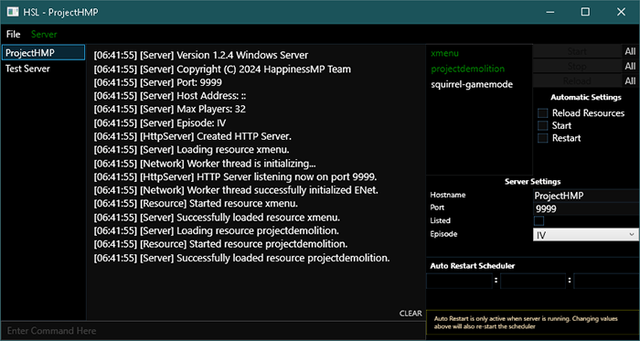

# HSL

Happiness Server Launcher. A Launcher & Manager for [HappinessMP](https://happinessmp.net/)



## Features
- Add, Create & Update Server(s).
- Start, Stop, Restart Server(s).
- Run Multiple Servers In One Launcher (No extra windows).
- Quick Edit Server Settings.
- Start, Stop & Reload Resource(s).
- Automatic Server Start & Restart. (Scheduled & Crash Restarts)
- Automatic Delete Logs (_Including Backups_)
- Delete Cache
- Console Adaptation

It's a very basic program, what much too expect? 

## Download 
#### From [Releases](https://github.com/ProjectHMP/HSL/releases) 
###### _All releases are stable (Tested)_

## Prerequisits

**HSL** .NETCore version was lowered to `3.1` in preventing manually installing the latest & greatest framework.

Everyone _should_ have this, though if program doesn't launch, you probably don't. **[Download .Net Core 3.1](https://dotnet.microsoft.com/en-us/download/dotnet/3.1)**.

## Build
You can clone this project and open it with **Visual Studio**, _granted it's a version supporting .net core 3.1_. Otherwise, you _could_ build using with `dotnet` without **Visual Studio**

Install **[.Net Core 3.1](https://dotnet.microsoft.com/en-us/download/dotnet/3.1)**
```batch
git clone https://github.com/ProjectHMP/HSL
cd HSL/HSL
dotnet build
```

`dotnet publish` to publish a single file executable
