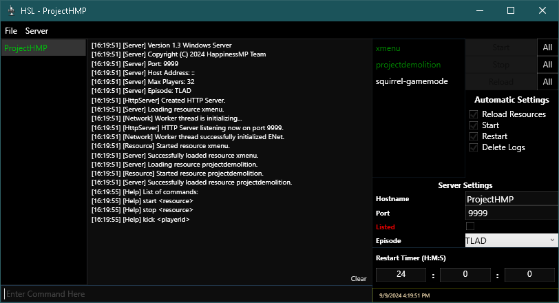

# HSL

Happiness Server Launcher. A Launcher & Manager for [HappinessMP](https://happinessmp.net/)



## Features
- Add, Create & Update Server(s).
- Start, Stop, Restart Server(s).
- Run Multiple Servers In One Launcher (No extra windows).
- Quick Edit Server Settings.
- Start, Stop & Reload Resource(s).
- Automatic Server Start & Restart. (Scheduled & Crash Restarts)
- Automatic Delete Logs (_Including Backups_)
- Delete Cache
- Console Adaptation

It's a very basic program, what much too expect? 

## Download 
#### From [Releases](https://github.com/ProjectHMP/HSL/releases) 
###### _All releases are stable (Tested)_

## Prerequisits

**HSL** .NETCore version was lowered to `3.1` in preventing manually installing the latest & greatest framework.

Everyone _should_ have this, though if program doesn't launch, you probably don't.

**[Download .Net Core 3.1](https://dotnet.microsoft.com/en-us/download/dotnet/3.1)**.

## Language Support

- English (Native/Default)
- German (Translated)

### Language Context

[Lang](HSL/Lang) directory contains `.xaml` language files, and `languages.xaml`.

- `languages.xaml` is used to define languages HSL will load. Each defined language has a `x:Key` attribute of the language file name _without extension_.

Duplicate `en.xaml` creating a new language file. Translate and define your language in `language.xaml`.

### Language Testing (_Without Building_)

You can place language file named `lang.xaml` next to `HSL.exe`. **HSL** will load and use this external language. 


## Build

Clone, and use **Visual Studio** to build/publish.

Optionally, you _could_ also build using with `dotnet`. **Visual Studio Code** w/ extensions may work, though you would still need **[.net core 3.1](https://dotnet.microsoft.com/en-us/download/dotnet/3.1)**

### Build Command Executions

```batch
git clone https://github.com/ProjectHMP/HSL
cd HSL/HSL
dotnet build | run | publish
```

